# Arquitectura de la aplicación

Este documento describe la arquitectura general, las capas de la aplicación y los flujos principales del proyecto **fp-virtual-gestion-docentes**, una aplicación Laravel para la gestión del profesorado de FP Virtual en Aragón.

---

## 1. Visión general

La aplicación sigue una arquitectura **monolítica en capas**, típica de Laravel, separando claramente:

- **Presentación**: vistas Blade, componentes, assets con Vite y Tailwind CSS.
- **Aplicación / HTTP**: controladores, form requests, middleware y rutas.
- **Dominio**: modelos Eloquent, servicios y lógica de negocio.
- **Datos**: base de datos relacional (MariaDB/MySQL en producción, SQLite en tests) gestionada mediante migraciones y seeders.

El patrón de diseño subyacente es **MVC (Modelo-Vista-Controlador)** con algunos elementos de **Domain-Driven Design** ligero, como la extracción de lógica de negocio a servicios (`GeneradorEmailVirtualService`) y el uso de modelos ricos con relaciones explícitas.

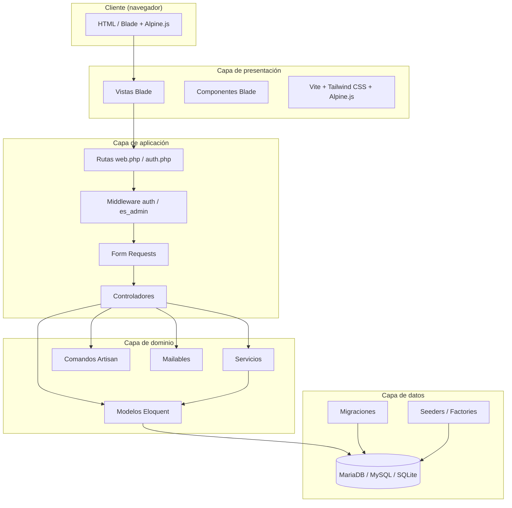

---

## 2. Stack tecnológico

| Capa | Tecnología | Versión / Detalle |
|------|------------|-------------------|
| Backend | PHP | `^8.2` |
| Framework | Laravel | `^12.0` |
| Base de datos | MariaDB | `10.11` (también compatible MySQL) |
| Auth | Laravel Breeze | scaffolding con Blade |
| Frontend | Blade + Tailwind CSS + Alpine.js | Vite compila assets |
| Bundler | Vite | `^6.3.2` |
| CSS | Tailwind CSS | `3.4.17` |
| Tests | Pest | `^3.8` con plugin Laravel |
| Formateo | Laravel Pint | `^1.21` |
| Contenedores | Docker + Docker Compose | perfiles local y servidor |

---

## 3. Estructura de directorios

```text
app/
├── Console/Commands/           # Comandos Artisan propios
├── Http/
│   ├── Controllers/            # Controladores web
│   │   ├── Admin/              # Panel de administración
│   │   └── Auth/               # Autenticación de Breeze
│   ├── Middleware/             # Middleware (EsAdmin, …)
│   ├── Requests/               # Form requests
├── Mail/                       # Mailables
├── Models/                     # Modelos Eloquent
├── Services/                   # Lógica de negocio reutilizable
└── View/Components/            # Componentes Blade

bootstrap/                      # Inicio de la aplicación
config/                         # Configuración de Laravel
database/
├── factories/                  # Factories para tests
├── migrations/                 # Migraciones
└── seeders/                    # Seeders

lang/es/                        # Traducciones en español
public/                         # Punto de entrada web
resources/
├── css/app.css                 # Directivas Tailwind
├── js/app.js                   # Alpine.js
└── views/                      # Vistas Blade

routes/
├── web.php                     # Rutas principales
├── auth.php                    # Rutas de autenticación Breeze
└── console.php                 # Tareas programadas

tests/                          # Tests con Pest
```

---

## 4. Capa de presentación

La capa de presentación está construida con **Blade**, **Tailwind CSS** y **Alpine.js**. Vite se encarga de compilar los assets.

### Layouts principales

| Layout | Uso |
|--------|-----|
| `layouts/app.blade.php` | Panel de centro |
| `layouts/guest.blade.php` | Login/registro invitado |
| `layouts/app-admin.blade.php` | Panel de administración |
| `layouts/admin.blade.php` | Navegación del panel admin |
| `layouts/navigation.blade.php` | Menú del panel de centro |

### Vistas principales

- **Centro**: `alta_docente`, `baja_docente`, `establecer_docencia`, `establecer_tutor`, `establecer_coordinador`, `dashboard`.
- **Admin**: `admin/login`, `admin/dashboard`, `admin/ver_docentes`, `admin/ver_centros`, `admin/alta_plataforma`.
- **Auth Breeze**: `auth/login`, `auth/register`, `auth/forgot-password`, etc.

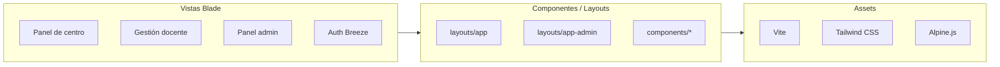

---

## 5. Capa de aplicación

### 5.1. Rutas

Las rutas se definen en tres archivos:

- `routes/web.php`: rutas principales de la aplicación (centro y admin).
- `routes/auth.php`: rutas de autenticación de Laravel Breeze.
- `routes/console.php`: tareas programadas.

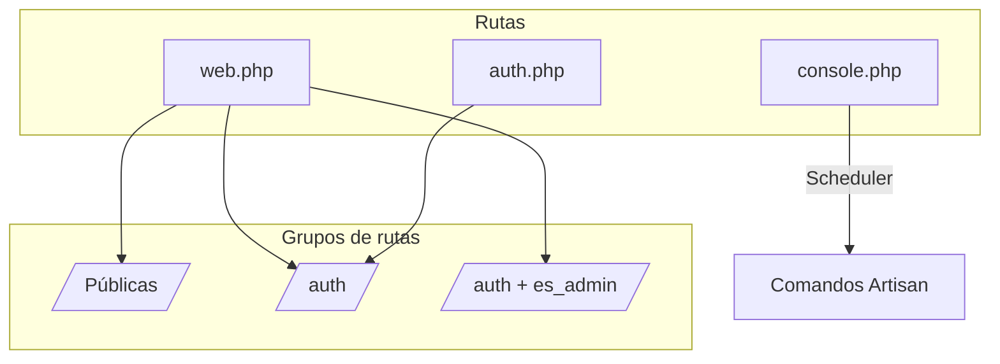

### 5.2. Middleware

| Middleware | Función |
|------------|---------|
| `auth` | Protege rutas para usuarios autenticados. |
| `es_admin` | Aborta con 403 si el usuario no tiene `is_admin = true`. |
| `verified` | Requiere email verificado (Breeze). |

### 5.3. Controladores

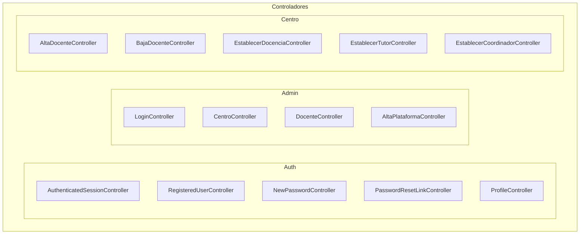

---

## 6. Capa de dominio

### 6.1. Modelos Eloquent

La aplicación utiliza modelos con claves primarias explícitas cuando no son autoincrementales enteras.

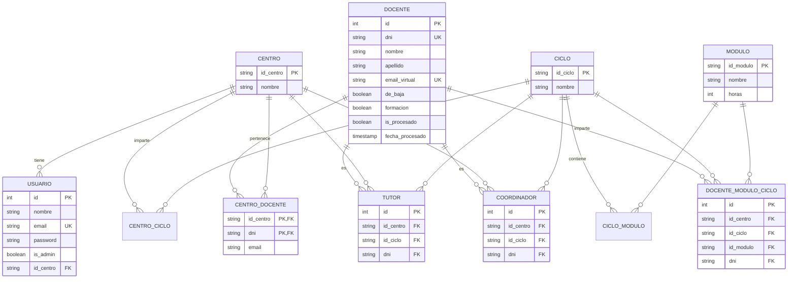

### 6.2. Servicios

| Servicio | Responsabilidad |
|----------|-----------------|
| `GeneradorEmailVirtualService` | Genera emails `@fpvirtualaragon.es` a partir de nombre y apellidos, normalizando caracteres y resolviendo colisiones. |

### 6.3. Comandos y tareas programadas

- `docentes:enviar-resumen-bajas`: lee el log de bajas y envía un resumen semanal por email. Programado los lunes a las 08:00 h (Europe/Madrid).

---

## 7. Flujo de autenticación

La aplicación tiene dos puntos de entrada sobre el mismo guard `web`:

1. **Login de centro** (`/login`): el campo de usuario es el **código del centro** (8 dígitos).
2. **Login de admin** (`/admin/login`): el usuario es `Admin` y debe tener `is_admin = true`.

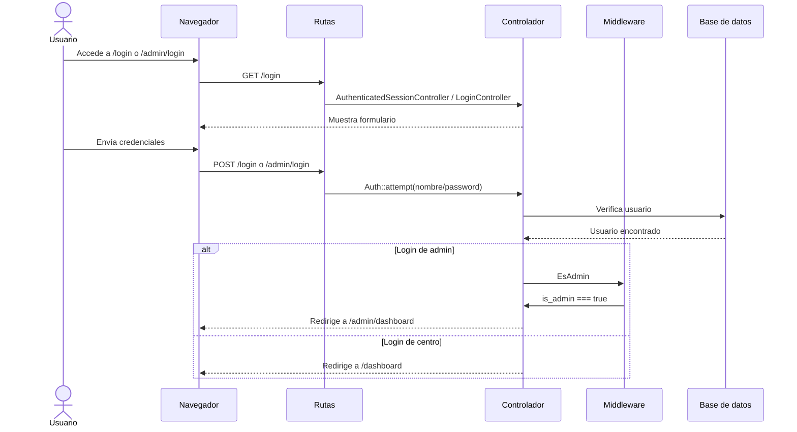

---

## 8. Flujo de alta de docente

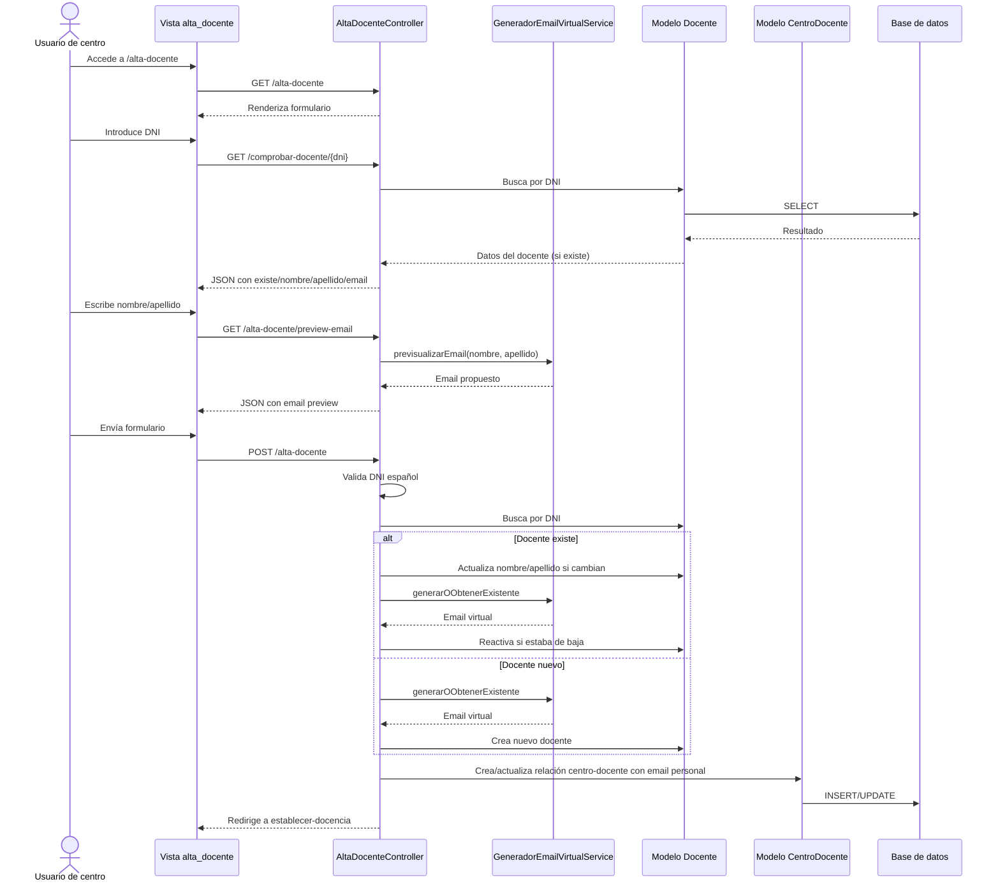

---

## 9. Flujo de baja de docente

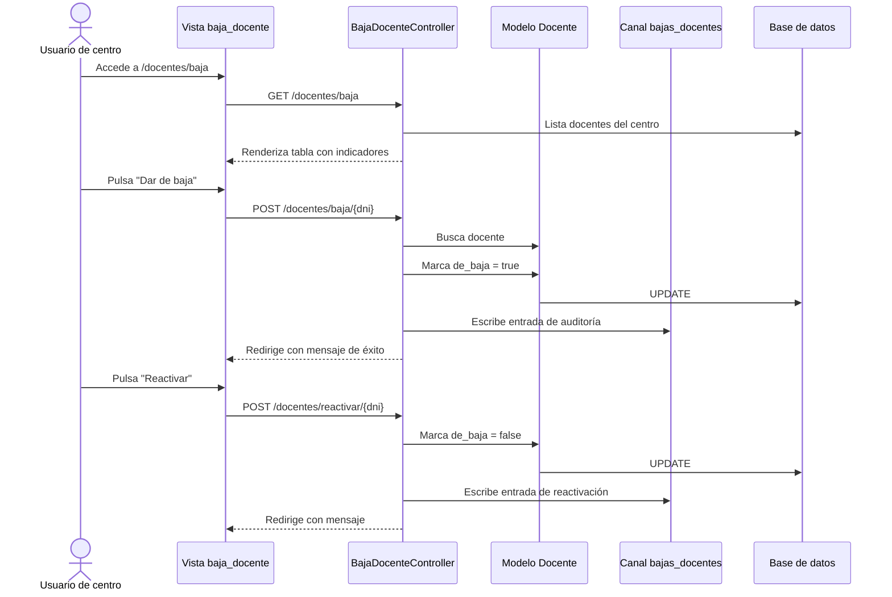

---

## 10. Flujo de alta en plataformas (Google Workspace / Moodle)

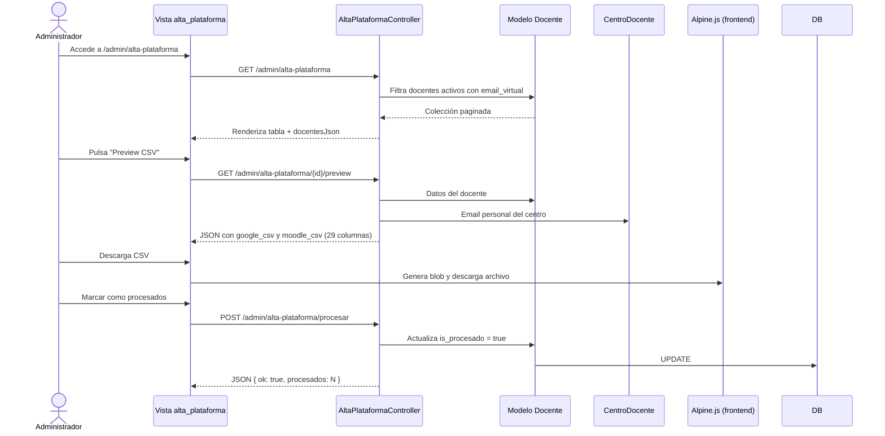

---

## 11. Flujo de asignación de docencia, tutoría y coordinación

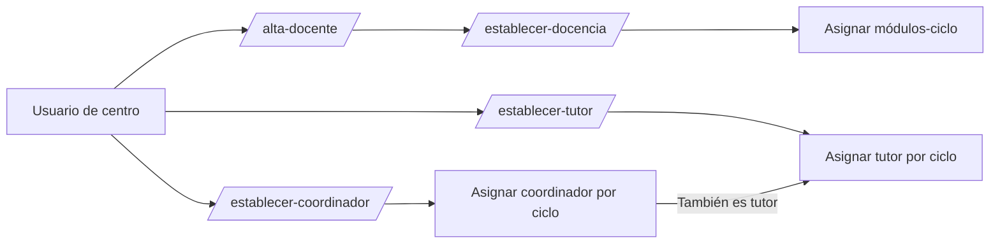

---

## 12. Comunicación entre capas

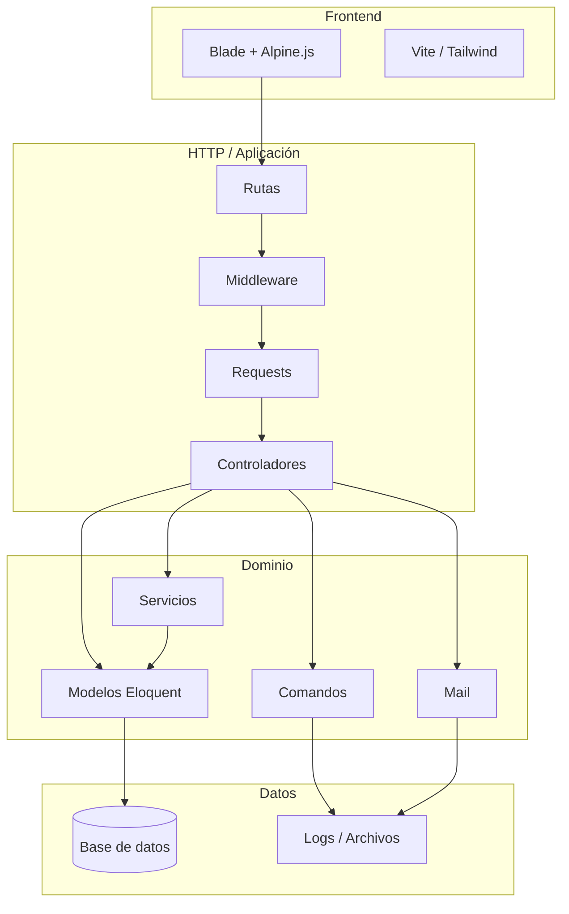

---

## 13. Despliegue y contenedores

La aplicación puede ejecutarse de dos formas principales:

1. **Desarrollo local**: `composer dev` levanta servidor Laravel, Vite, worker de colas y logs en vivo.
2. **Servidor/Docker**: `docker-compose.server.yml` construye la imagen y despliega app + base de datos.

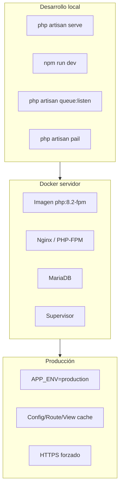

---

## 14. Resumen de capas

| Capa | Componentes principales | Responsabilidad |
|------|-------------------------|-----------------|
| Presentación | Blade, Tailwind, Alpine.js, Vite | Renderizar la interfaz de usuario y gestionar interacciones ligeras. |
| Aplicación | Rutas, middleware, requests, controladores | Recibir peticiones HTTP, validar entrada, orquestar respuestas. |
| Dominio | Modelos Eloquent, servicios, comandos, mailables | Encapsular la lógica de negocio y las reglas del dominio. |
| Datos | Migraciones, seeders, factories, base de datos | Persistir y recuperar información de forma estructurada. |

Esta arquitectura permite mantener una separación clara de responsabilidades, facilitando el mantenimiento, la extensión futura y la cobertura de tests del proyecto.
