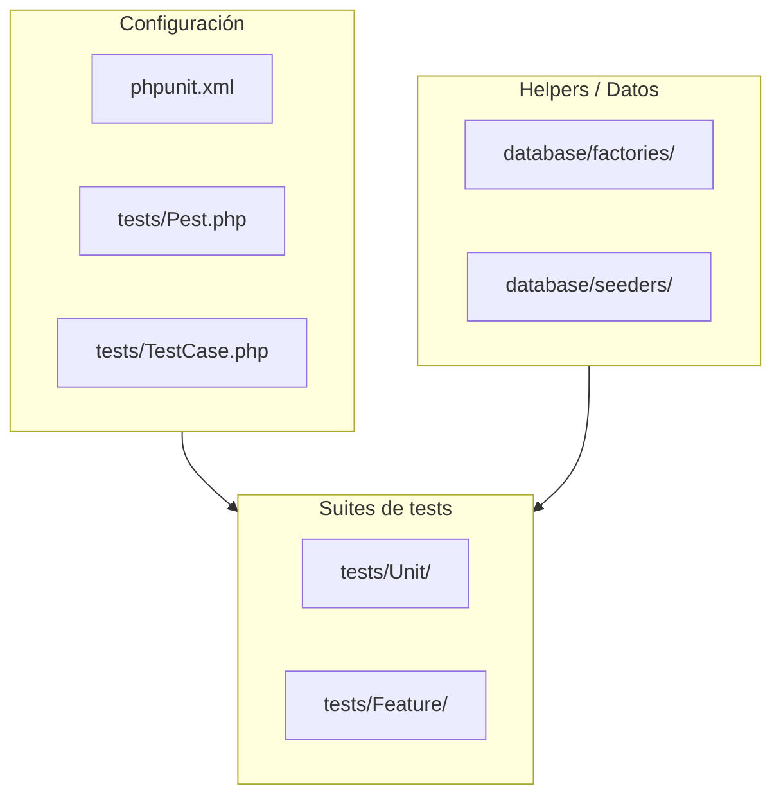
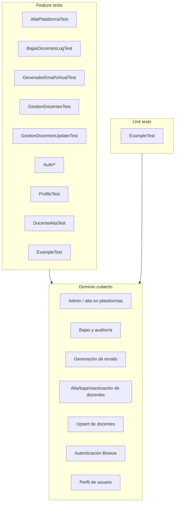

# Testing en la aplicación

Este documento describe el proceso de testing del proyecto **fp-virtual-gestion-docentes**: framework de testing, configuración, estructura de tests y descripción detallada de cada conjunto de pruebas.

---

## 1. Visión general

El proyecto utiliza **Pest PHP 3** sobre PHPUnit como framework principal de testing. Los tests se organizan en dos suites:

- **Unit**: pruebas unitarias puras, sin dependencia de la base de datos.
- **Feature**: pruebas de funcionalidad que interactúan con la aplicación Laravel, rutas, base de datos y servicios.

La suite de Feature aplica el trait `RefreshDatabase`, de modo que cada test se ejecuta sobre una base de datos SQLite en memoria recién creada, garantizando aislamiento entre pruebas.



---

## 2. Framework y herramientas

| Herramienta | Versión | Uso |
|-------------|---------|-----|
| Pest | `^3.8` | Framework de testing con sintaxis expresiva. |
| PHPUnit | incluido con Pest | Motor de ejecución de tests. |
| RefreshDatabase | Laravel | Resetea la BD en cada test de Feature. |
| Factories | Laravel | Crear modelos de prueba fácilmente. |
| Mail::fake / Notification::fake / Event::fake | Laravel | Aislar envío de emails, notificaciones y eventos. |

---

## 3. Configuración de testing

### 3.1. `phpunit.xml`

Define las suites de tests y las variables de entorno para el entorno de testing:

- `APP_ENV=testing`
- `DB_CONNECTION=sqlite`
- `DB_DATABASE=:memory:`
- `MAIL_MAILER=array`
- `QUEUE_CONNECTION=sync`
- `CACHE_STORE=array`
- `SESSION_DRIVER=array`
- `BCRYPT_ROUNDS=4` (hash más rápido en tests)

La cobertura de código se limita al directorio `app/`.

### 3.2. `tests/Pest.php`

- Extiende `Tests\TestCase` para todos los tests.
- Aplica `RefreshDatabase` automáticamente a los tests del directorio `Feature`.
- Incluye una expectativa de ejemplo `toBeOne()` y un helper vacío `something()`.

### 3.3. `tests/TestCase.php`

Clase base abstracta que hereda de `Illuminate\Foundation\Testing\TestCase`. No añade métodos ni traits adicionales.

---

## 4. Cómo ejecutar los tests

```bash
# Toda la suite
./vendor/bin/pest

# Un fichero concreto
./vendor/bin/pest tests/Feature/GeneradorEmailVirtualTest.php --no-coverage

# Filtrar por nombre
./vendor/bin/pest --filter "genera el email correcto"

# Con cobertura
./vendor/bin/pest --coverage
```

También es recomendable ejecutar `./vendor/bin/pint` antes de commitear para mantener el formato del código.

---

## 5. Estructura de los tests

```text
tests/
├── Feature/
│   ├── AltaPlataformaTest.php
│   ├── Auth/
│   │   ├── AuthenticationTest.php
│   │   ├── EmailVerificationTest.php
│   │   ├── PasswordConfirmationTest.php
│   │   ├── PasswordResetTest.php
│   │   ├── PasswordUpdateTest.php
│   │   └── RegistrationTest.php
│   ├── BajasDocentesLogTest.php
│   ├── DocenteAltaTest.php
│   ├── ExampleTest.php
│   ├── GeneradorEmailVirtualTest.php
│   ├── GestionDocentesTest.php
│   ├── GestionDocentesUpdateTest.php
│   └── ProfileTest.php
├── Unit/
│   └── ExampleTest.php
├── Pest.php
└── TestCase.php
```



---

## 6. Descripción detallada de los tests

### 6.1. `AltaPlataformaTest.php`

**Issue relacionado:** #60/#61/#62 — Alta en plataformas (Google Workspace / Moodle).

Cubre el panel de administración para exportar docentes a plataformas externas.

| Bloque | Test | Escenario | Verificación principal |
|--------|------|-----------|------------------------|
| Acceso | A1 | Usuario anónimo accede a `/admin/alta-plataforma` | Redirección a `/admin/login` |
| Acceso | A2 | Usuario sin permisos de admin | `assertForbidden()` por middleware `EsAdmin` |
| Acceso | A3 | Admin autenticado | Vista carga correctamente (`200`) |
| Acceso | A4 | Vista muestra docentes con `email_virtual` | `assertSee` con datos del docente |
| Acceso | A5 | Vista oculta docentes dados de baja | `assertDontSee` con docente de baja |
| Acceso | A6/A7 | Filtros `estado=pendiente` / `estado=procesado` | Solo muestra docentes del estado filtrado |
| `procesarAltas` | B1 | POST sin autenticar | Redirección a login |
| `procesarAltas` | B2 | Marca docente como procesado | JSON `{ ok: true }`, `is_procesado=true`, `fecha_procesado` no nulo |
| `procesarAltas` | B3 | No modifica docentes de baja | `is_procesado=false` para docente dado de baja |
| `procesarAltas` | B4-B6 | Validación del campo `ids` | Requerido, array y IDs existentes |
| `procesarAltas` | B7 | Cuenta procesados correctamente | JSON indica `procesados: 2` |
| Preview CSV | C1 | Estructura JSON del preview | `google_csv`, `moodle_csv`, headers presentes |
| Preview CSV | C2 | Google CSV tiene 29 columnas | `expect(count)->toBe(29)` |
| Preview CSV | C3 | Columnas 4 y 6 correctas | Contraseña `Cambiam3!_`, Org Unit `/Profesorado` |
| Preview CSV | C4 | Email personal en columnas 8 y 10 | `Recovery Email` y `Work Secondary Email` |
| Preview CSV | C5-C7 | Moodle CSV 29 columnas y headers | Estructura esperada |
| Búsqueda | D1-D4 | Filtros por nombre, apellido y DNI | Resultados acordes al término de búsqueda |

**Helpers locales:**

- `adminUser()`: crea un usuario y fuerza `is_admin = true` vía `forceFill`.
- `docenteConEmail()`: crea docentes de prueba con DNI secuencial y `email_virtual`.

---

### 6.2. `BajasDocentesLogTest.php`

**Issue relacionado:** #7 — Auditoría y notificaciones de bajas de docentes.

Verifica tanto la escritura de logs de auditoría como el comando de resumen semanal.

#### Bloque A — Auditoría en `BajaDocenteController`

| Test | Escenario | Verificación |
|------|-----------|--------------|
| A1 | Baja exitosa | El log contiene `INFO`, `Baja de docente procesada` y el DNI |
| A2 | Baja incluye ID de usuario | El log contiene el ID del usuario que realizó la acción |
| A3 | Reactivación exitosa | El log contiene `NOTICE`, `Docente reactivado` y el DNI |
| A4 | Fallo de baja (DNI inexistente) | El log contiene `CRITICAL`, `Error al dar de baja` y DNI en mayúsculas |
| A5 | Fallo de reactivar (DNI inexistente) | El log contiene `ERROR`, `Error al reactivar` y el DNI |
| A6 | No escribe en `laravel.log` | El contenido de `laravel.log` no incluye el mensaje de baja |
| A7 | Múltiples bajas | El fichero contiene ambos DNIs y al menos dos líneas |

#### Bloque B — Comando `docentes:enviar-resumen-bajas`

| Test | Escenario | Verificación |
|------|-----------|--------------|
| B1 | Con registros recientes envía email | `Mail::assertSent(ResumenBajasDocentes::class, 1)` |
| B2 | Mailable recibe registros del log | La línea reciente está en `$mail->registros` |
| B3 | Mailable recibe Carbon `$desde` | `$mail->desde` es instancia de Carbon |
| B4 | Rotación vacía el log tras envío | El log contiene `Resumen semanal enviado` |
| B5 | Solo registros antiguos → no envía | `assertNothingSent()` |
| B6 | Antiguos se conservan tras rotación | Contiene línea antigua, no la reciente |
| B7 | `--dry-run` no envía email | `assertNothingSent()` |
| B8 | `--dry-run` no modifica log | Contenido idéntico al original |
| B9 | `--dry-run` imprime líneas | Salida contiene `MODO DRY-RUN` y mensaje de baja |
| B10 | Un solo email aunque haya muchos registros | `assertSent(..., 1)` |
| B11 | Múltiples registros recientes incluidos | `count($mail->registros) === 3` |
| B12 | Mezcla recientes/antiguos solo recientes | `count === 1`, reciente presente, antigua ausente |

#### Bloque C — Casos límite del comando

| Test | Escenario | Verificación |
|------|-----------|--------------|
| C1 | Fichero inexistente | Salida indica que no existe, no se envía email |
| C2 | Fichero vacío | Salida indica que no se encontraron bajas |
| C3 | Exit code 0 | `assertSuccessful()` |
| C4 | Imprime número de registros | Salida contiene la palabra `registros` |
| C5 | Log recibe entradas tras rotación | Simula nueva baja tras envío y verifica DNI en log |

**Gestión del fichero de log:**

- `beforeEach`: limpia `storage/logs/docentes_baja.log`.
- `afterEach`: borra el fichero de log.

---

### 6.3. `GeneradorEmailVirtualTest.php`

**Issue relacionado:** #58 — Generación de correo `@fpvirtualaragon.es`.

Cubre el algoritmo de generación de emails virtuales y su integración con el alta de docentes.

#### Bloque A — Algoritmo del servicio

| Test | Escenario | Verificación |
|------|-----------|--------------|
| A1-A2 | Ejemplos reales de la tabla de docentes | Emails como `durena@fpvirtualaragon.es`, `mroyl@fpvirtualaragon.es` |
| A3 | Un nombre + dos apellidos | Iniciales + primer apellido + inicial segundo apellido |
| A4 | Un solo apellido | Funciona sin segundo apellido |
| A5 | Acentos eliminados | `á` → `a`, `é` → `e`, etc. |
| A6 | `ñ` → `n` | Normalización correcta |
| A7 | Múltiples nombres | Todas las iniciales de los nombres |
| A8 | Dominio siempre `fpvirtualaragon.es` | Sufijo correcto |
| A9 | Resultado en minúsculas | No hay mayúsculas en la parte local |
| A10 | Parte local solo `[a-z0-9]` | Caracteres no alfanuméricos eliminados |

#### Bloque B — Integración con alta de docentes

| Test | Escenario | Verificación |
|------|-----------|--------------|
| B1 | Alta genera email_virtual automáticamente | `lsanchezp@fpvirtualaragon.es` |
| B2 | email_virtual termina en dominio correcto | `toEndWith('@fpvirtualaragon.es')` |
| B3 | Email personal va a `centro_docente`, no a `email_virtual` | `assertDatabaseHas('centro_docente', ...)` |
| B4 | Docente existente conserva email_virtual original | No se sobrescribe |

#### Bloque C — Endpoint AJAX `previewEmail`

| Test | Escenario | Verificación |
|------|-----------|--------------|
| C1 | Preview con nombre y apellido | `assertJson(['email' => 'mtorresr@fpvirtualaragon.es'])` |
| C2 | Falta nombre | `assertJson(['email' => null])` |
| C3 | Falta apellido | `assertJson(['email' => null])` |

#### Bloque D — Colisiones

| Test | Escenario | Verificación |
|------|-----------|--------------|
| D1 | Email ya existe → sufijo `2` | `agarcial2@fpvirtualaragon.es` |
| D2 | Sufijo 2 ocupado → prueba 3 | `ab3@fpvirtualaragon.es` |
| D3 | Docente existente → devuelve su email | `lperezs@fpvirtualaragon.es` |
| D4 | Endpoint `/comprobar-docente/{dni}` devuelve `email_virtual` | `assertJsonPath('email_virtual', ...)` |

---

### 6.4. `GestionDocentesTest.php`

Cubre el alta, la normalización, la validación, la baja y la reactivación de docentes.

| # | Test | Escenario | Verificación |
|---|------|-----------|--------------|
| 1 | Accesibilidad | GET `/alta-docente` autenticado | `assertStatus(200)` con `withoutVite()` |
| 2 | Normalización nombre/apellido | Minúsculas sin tildes especiales | `Juan Ignacio`, `Pérez De La O` |
| 3 | Normalización DNI | DNI en minúsculas | DNI almacenado en mayúsculas |
| 4 | Validación DNI duplicado | Segundo POST con mismo DNI | `assertSessionHasErrors(['dni'])` |
| 5 | Baja de docente | POST `/docentes/baja/{dni}` | `de_baja=1` en base de datos |
| 6 | Reactivación de docente | POST `/docentes/reactivar/{dni}` | `de_baja=0` en base de datos |

---

### 6.5. `GestionDocentesUpdateTest.php`

Cubre el comportamiento **upsert** del alta de docente: si el DNI ya existe, el docente se actualiza en lugar de crear duplicados.

| Bloque | Test | Escenario | Verificación |
|--------|------|-----------|--------------|
| 1 | 7 | DNI existente vía AJAX | Devuelve `existe=true`, nombre, apellido y email del centro |
| 1 | 8 | DNI inexistente vía AJAX | Devuelve `existe=false` |
| 2 | 9 | DNI ya registrado no provoca error | `assertSessionDoesntHaveErrors(['dni'])` |
| 2 | 10 | `email_virtual` no se modifica si ya existe | Se mantiene el email original; email personal va a `centro_docente` |
| 3 | 11 | Actualizar no duplica registros | `Docente::count()` igual antes y después |

---

### 6.6. `DocenteAltaTest.php`

Test simple que verifica la normalización de nombre y apellido en el endpoint de alta.

| Test | Escenario | Verificación |
|------|-----------|--------------|
| Normalización | Envía `nombre='mario.'`, `apellido='marioº'` | Base de datos contiene `Mario` / `Mario` |

> **Nota:** este test utiliza la ruta `/docentes/guardar`, que actualmente no existe en `routes/web.php`. El endpoint real es `/alta-docente`.

---

### 6.7. `ProfileTest.php`

Tests heredados de Laravel Breeze para la gestión del perfil de usuario.

| Test | Escenario | Verificación |
|------|-----------|--------------|
| profile page is displayed | GET `/profile` | `assertOk()` |
| profile information can be updated | PATCH `/profile` cambia name/email | Sin errores, redirige a `/profile`, campos actualizados |
| email verification status is unchanged | PATCH sin cambiar email | `email_verified_at` sigue sin ser null |
| user can delete their account | DELETE `/profile` con password correcta | Sin errores, redirige a `/`, usuario invitado, usuario eliminado |
| correct password must be provided | DELETE con password incorrecta | Error en `userDeletion.password`, usuario no eliminado |

> **Problema conocido:** este test usa `User::factory()`, pero el modelo real del proyecto es `App\Models\Usuario`.

---

### 6.8. Tests de autenticación (`tests/Feature/Auth/`)

Estos tests provienen del scaffolding de Laravel Breeze.

#### `AuthenticationTest.php`

| Test | Escenario | Verificación |
|------|-----------|--------------|
| login screen can be rendered | GET `/login` | `assertStatus(200)` |
| users can authenticate | POST `/login` con email y password | `assertAuthenticated()`, redirige a `dashboard` |
| users can not authenticate with invalid password | Password incorrecto | `assertGuest()` |
| users can logout | POST `/logout` autenticado | `assertGuest()`, redirige a `/` |

> **Problema conocido:** usa `User::factory()` y campo `email`/`name`, mientras la app usa `Usuario` y `nombre`.

#### `EmailVerificationTest.php`

| Test | Escenario | Verificación |
|------|-----------|--------------|
| email verification screen can be rendered | GET `/verify-email` autenticado | `assertStatus(200)` |
| email can be verified | URL firmada correcta | Evento `Verified` despachado, email verificado |
| email is not verified with invalid hash | Hash incorrecto | Email no verificado |

#### `PasswordConfirmationTest.php`

| Test | Escenario | Verificación |
|------|-----------|--------------|
| confirm password screen can be rendered | GET `/confirm-password` | `assertStatus(200)` |
| password can be confirmed | POST con password correcto | Redirige, sin errores de sesión |
| password is not confirmed with invalid password | Password incorrecto | `assertSessionHasErrors()` |

#### `PasswordResetTest.php`

| Test | Escenario | Verificación |
|------|-----------|--------------|
| reset password link screen can be rendered | GET `/forgot-password` | `assertStatus(200)` |
| reset password link can be requested | POST email | Notificación `ResetPassword` enviada |
| reset password screen can be rendered | GET `/reset-password/{token}` | `assertStatus(200)` |
| password can be reset with valid token | POST reset con token | Sin errores, redirige a `login` |

#### `PasswordUpdateTest.php`

| Test | Escenario | Verificación |
|------|-----------|--------------|
| password can be updated | PUT `/password` con contraseña actual correcta | Sin errores, redirige a `/profile`, hash actualizado |
| correct password must be provided | Contraseña actual incorrecta | Error en `updatePassword.current_password` |

#### `RegistrationTest.php`

| Test | Escenario | Verificación |
|------|-----------|--------------|
| registration screen can be rendered | GET `/register` | `assertStatus(200)` |
| new users can register | POST `/register` con name, email, password | `assertAuthenticated()`, redirige a `dashboard` |

> **Problema conocido:** el controlador `RegisteredUserController` usa `User::class` y campos `name`, mientras el modelo real es `Usuario` con `nombre`.

---

### 6.9. Tests de ejemplo

#### `tests/Feature/ExampleTest.php`

| Test | Escenario | Verificación |
|------|-----------|--------------|
| returns a successful response | GET `/` | `assertStatus(200)` |

> **Nota:** `/` redirige a `/login`, por lo que este test puede estar obsoleto.

#### `tests/Unit/ExampleTest.php`

| Test | Verificación |
|------|--------------|
| that true is true | `expect(true)->toBeTrue()` |

---

## 7. Patrones comunes en los tests

### 7.1. Creación de centros y usuarios

```php
$centro = Centro::forceCreate(['id_centro' => 'CXXX', 'nombre' => 'Centro Test']);
$usuario = Usuario::factory()->create(['id_centro' => 'CXXX']);
$this->actingAs($usuario)->...
```

### 7.2. Creación de administradores

```php
$admin = Usuario::factory()->create();
$admin->forceFill(['is_admin' => true])->save();
$this->actingAs($admin)->...
```

### 7.3. Creación de docentes

```php
Docente::forceCreate([
    'dni' => '12345678A',
    'nombre' => 'María',
    'apellido' => 'García López',
    'email_virtual' => 'mgarcial@fpvirtualaragon.es',
]);
```

### 7.4. Falsificación de servicios

- `Mail::fake()` para emails.
- `Notification::fake()` para notificaciones.
- `Event::fake()` para eventos.

### 7.5. Limpieza de archivos

`BajasDocentesLogTest` utiliza `beforeEach` y `afterEach` para gestionar `storage/logs/docentes_baja.log`.

---

## 8. Problemas y observaciones conocidas

| Problema | Archivos afectados | Descripción |
|----------|-------------------|-------------|
| `User` vs `Usuario` | `Auth/*`, `ProfileTest.php`, `RegisteredUserController`, `NewPasswordController` | Tests y controladores de Breeze usan `User::class`, pero el modelo real es `Usuario`. |
| Campo `name` vs `nombre` | `Auth/RegistrationTest.php`, `ProfileTest.php` | Se envía `name`, pero el modelo espera `nombre`. |
| Ruta obsoleta | `DocenteAltaTest.php` | Usa `/docentes/guardar`; la ruta real es `/alta-docente`. |
| Test de ejemplo obsoleto | `Feature/ExampleTest.php` | GET `/` redirige a `/login`. |
| Cobertura incompleta | — | No hay tests para coordinadores, tutores, docencia, exportaciones CSV del admin ni login de admin. |

---

## 9. Matriz de cobertura por dominio

| Dominio | Tests principales | Estado |
|---------|-------------------|--------|
| Alta en plataformas | `AltaPlataformaTest.php` | ✅ Completo |
| Generación de emails | `GeneradorEmailVirtualTest.php` | ✅ Completo |
| Alta/baja/reactivación de docentes | `GestionDocentesTest.php`, `GestionDocentesUpdateTest.php` | ✅ Completo |
| Auditoría de bajas | `BajasDocentesLogTest.php` | ✅ Completo |
| Autenticación Breeze | `Auth/*` | ⚠️ Roto por `User`/`Usuario` |
| Perfil de usuario | `ProfileTest.php` | ⚠️ Roto por `User`/`Usuario` |
| Tutores / Coordinadores | — | ❌ Sin cobertura |
| Docencia | — | ❌ Sin cobertura |
| Exportaciones CSV admin | — | ❌ Sin cobertura |

---

## 10. Recomendaciones

1. **Unificar modelo de usuario**: migrar todos los tests y controladores de Breeze de `User` a `Usuario` y de `name` a `nombre`.
2. **Corregir ruta obsoleta**: actualizar `DocenteAltaTest.php` para usar `/alta-docente`.
3. **Añadir tests faltantes**: coordinadores, tutores, docencia y exportaciones CSV del panel admin.
4. **Mantener el formato**: ejecutar `./vendor/bin/pint` antes de cada commit.
5. **Ejecutar tests en CI**: integrar `./vendor/bin/pest` en el pipeline de GitHub Actions cuando se reactive el workflow de Docker.
